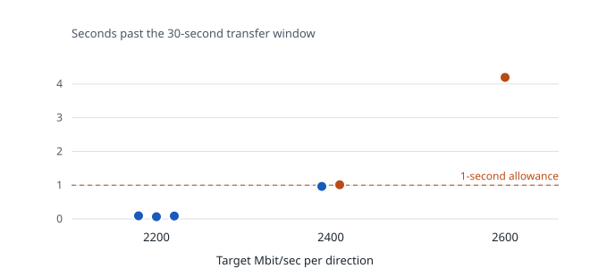
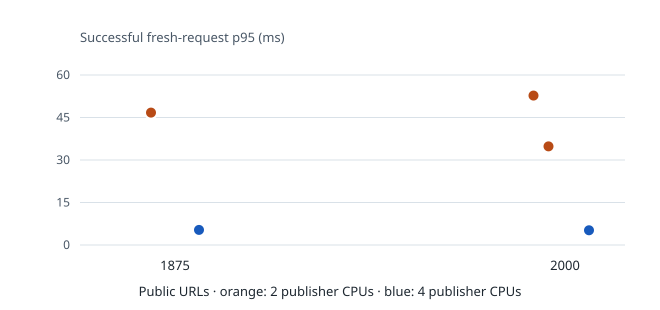
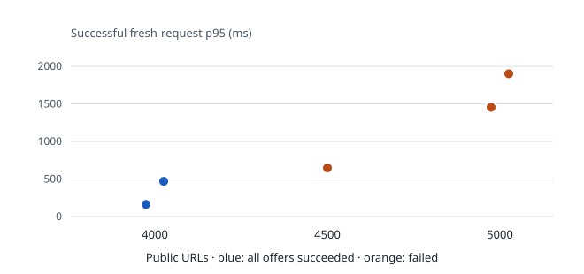

# local capacity results

These are local Docker measurements, not production limits. The tests used real
publishers and visitors, but shared a Docker host and one PostgreSQL instance.
The [capacity plan](capacity-plan.md) describes the longer, repeated, degraded
tests needed before setting a deployed operating limit.

| Workload                | What the local runs showed                                                                                                                                                         |
| ----------------------- | ---------------------------------------------------------------------------------------------------------------------------------------------------------------------------------- |
| Held streams            | 6,400 survived and progressed in three full runs; an 8,000-stream long run did not finish cleanly.                                                                                 |
| Fresh visitors          | 2,000/sec passed two five-minute direct and tunneled runs; the active relay was near its one-CPU quota.                                                                            |
| Bidirectional bandwidth | 2,200 Mbit/sec **per direction** passed two five-minute runs; 2,400 missed the five-minute completion deadline.                                                                    |
| Active publish runs     | 10,000 completed five times with raised relay connection limits, but one additional run failed during activation. This tested a configured ceiling, not a resource limit.          |
| Combined traffic        | Two one-minute 4,000-public-URL runs passed on a 16 GiB Docker VM; matched 4,500 and 5,000 runs failed fresh-traffic checks. Latency varied sharply even between the passing runs. |

## bandwidth: completion matters

The chart shows 30-second transfers on the 1 CPU / 2 GiB server-role profile.
Each dot is a run, with 64 streams **in each direction**. Transfers delivered
the exact bytes, but a run fails if it completes more than one second after the
requested window. The y-axis starts at zero _overrun_, not zero elapsed time.

Three 2,200 Mbit/sec trials passed. Of two 2,400 trials, one finished in
30.963s and the other in 31.012s, just beyond the 31s deadline. The
2,600 trial finished in 34.193s and failed. The direct path met its budget
in these comparisons. In separate **five-minute** runs, 2,200 passed twice
and 2,400 failed at 319.313s against a 301s deadline. Do not combine the
30-second and five-minute points into one capacity claim.

## the publisher generator changed latency

The combined five-minute runs below used the same traffic mix: 438 fresh
visitors/sec, 1,400 held streams, and 481 Mbit/sec in each direction. Only
the **publisher generator's** CPU quota changed in each matched comparison;
server-role quotas stayed at 1 CPU / 2 GiB. All offered fresh requests
succeeded in these runs.

| Public URLs | Generator CPUs |            Fresh-request p95 |
| ----------: | -------------: | ---------------------------: |
|       1,875 |          2 → 4 |            46.726 → 5.326 ms |
|       2,000 |          2 → 4 | 52.740 and 34.813 → 5.198 ms |

The apparent latency rise with more public URLs was largely a generator
headroom effect in this profile. It was not a measured tnl server limit.

## combined traffic: repeated outcomes

These runs used four publisher generators and a 16 GiB Docker VM. As the public
URL count increased, the offered fresh rate, held streams, and bidirectional
bandwidth **also increased**. The relay publisher-connection limit was raised
from 4,000 to 8,000 above 4,000 public URLs. The chart is a record of these
workloads, not an isolated public-URL scaling curve. Each dot is a complete
one-minute run; p95 counts successful fresh requests only.

| Public URLs | Fresh/sec · held · Mbit/sec each way | Fresh successes / offered        | p95 (ms)             | Result                                |
| ----------: | ------------------------------------ | -------------------------------- | -------------------- | ------------------------------------- |
|       4,000 | 876 · 2,800 · 962                    | 52,560 / 52,560 twice            | 161.633; 468.997     | Two clean runs                        |
|       4,500 | 986 · 3,150 · 1,082                  | 59,054 / 59,160                  | 647.239              | Failed: 57 requests, 49 missed offers |
|       5,000 | 1,095 · 3,500 · 1,203                | 60,063 / 65,700; 53,828 / 65,700 | 1,453.537; 1,900.738 | Both failed fresh traffic             |

A third named 4,000-public-URL attempt stopped before visitor traffic and is
not plotted. The two complete 4,000 runs passed correctness, but their p95s
varied nearly threefold. One 4,500 run on a smaller VM passed; the larger-VM
run above did not. Neither result establishes a repeatable operating limit.

To separate public-URL count from visitor load, two more runs kept **3,000
public URLs and the 5,000-public-URL traffic mix** fixed. Only relay CPU changed:

| CPUs per relay | Fresh successes / offered | Missed offers |  Fresh p95 |
| -------------: | ------------------------: | ------------: | ---------: |
|              1 |           65,570 / 65,700 |           130 | 903.838 ms |
|              2 |           65,700 / 65,700 |             0 | 256.703 ms |

Both direct baselines passed. The extra relay CPU removed throttling and
restored fresh-traffic correctness in this **3,000-public-URL** comparison.
It does not turn either 5,000-public-URL run into a pass.

## use the numbers carefully

The [chart data](data/local-capacity.json) records each plotted run and its
values. Its run name is the matching directory under the ignored
`bench-results/`; publisher-generator comparisons were collected in the
`main-integration` worktree. The chart sources are
`tunnel-bandwidth-summary.json`, `steady-exact-latency.json`, and
`steady-summary.json`. The dataset and SVGs are committed so the comparisons
remain readable when local artifacts are unavailable. Regenerate the figures
with `mise exec -- node scripts/render-local-capacity.ts` and check them with
`mise exec -- node scripts/render-local-capacity.ts --check`.

These results have different durations, topology settings, configured limits,
and generator headroom. No result here includes a health-aware ingress address
or highly available PostgreSQL. For workload commands, see
[local workloads](local-workloads.md).
